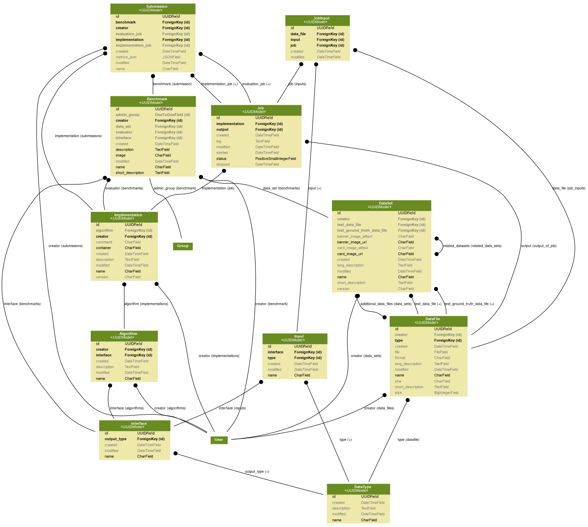

Overview
========

Entities & relations
--------------------

The platform contains :ref:`models.DataFile`, which represent both data (the bits themselves) and metadata. Each
:ref:`models.DataFile` is of a specific :ref:`models.DataType`. A :ref:`models.DataSet` is a collection of
:ref:`models.DataFile`'s.

An :ref:`models.Interface` represents the interface of one or many :ref:`models.Implementation`'s, e.g. it defines
the names and :ref:`models.DataType`'s as :ref:`models.Input` and defines a single output :ref:`models.DataType`.

Each :ref:`models.Implementation` is linked to a Docker image and belongs to
(represents different versions of) an :ref:`models.Algorithm`.

Whenever an :ref:`models.Implementation` is applied to a :ref:`models.Benchmark` as a :ref:`models.Submission`,
it will be evaluated. This is done in two stages:

- The :ref:`models.Benchmark` is linked to a :ref:`models.DataSet`. The DataSet contains a `test_data_file` field,
  :ref:`models.Implementation` is ran with this `test_data_file` as input, and it should produce an output according to the Benchmark's `interface`.

- The output of the first step, together with the Benchmark's DataSet.ground_truth_data_file are input to an
  Implementation defined by the Benchmark's `evaluator`. This Implementation should product as output a DataFile of type
  'OutputMetrics'.

Each time an :ref:`models.Implementation` is run, this creates a :ref:`models.Job`, which contains status, logs etc.